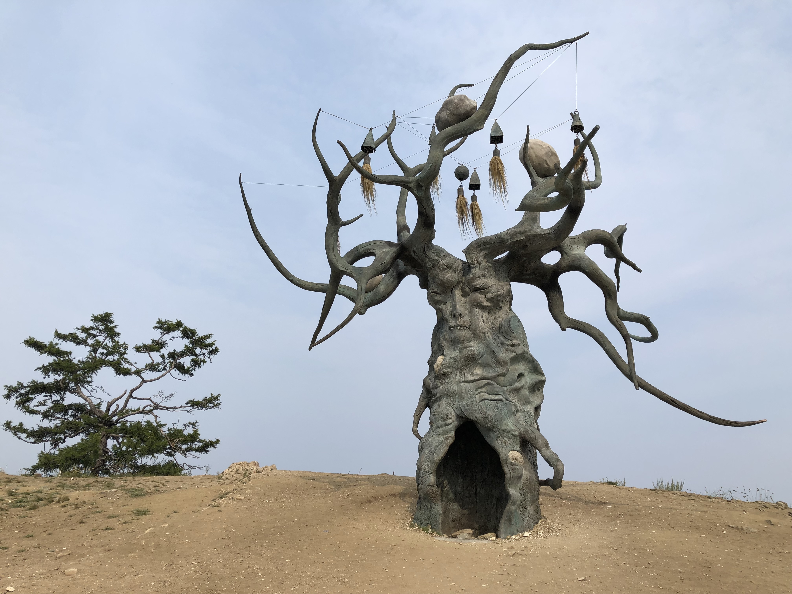

# Добавление картинки в MD
Чтобы добавить картинку в MD, нужно 
1. Добавить файл с картинкой (обычно jpg) в папку репозиторий;
2. Выполняем команду ![] (), Например,

# Работа с ветками (branches)
* ## Создание веток

    Чтоы создать ветку, нужно выполнить команду:
    git branch <......>, Например:
    git branch Branches_commands_descriptions
    
* ## Переключение между ветками

    Чтобы переключиться между ветками, нужно выполнить команду:

    git checkout <......>, Например:
    
    git checkout Branches_commands_descriptions

 * ## Обзор списка веток

    Чтобы посмотреть все созданные ветки, нужно выполнить команду:
    
        git branch
        
>Все доступные ветки в репозитории отобразяться в окне терминала
    
# Действия с ветками (branches)
* ## Объединение веток
    Чтобы объединить ветки, нужно:
    1. перейти в ту ветку, куда мы хотим добавить изменения;
    2. выполнить команду: git merge <......>, Например,
    
        git merge Editing_branches_descriptions
    
* ## Удаление веток

    Чтобы удалить ветку, нужно выполнить команду git - d <......>, Например:

    git -d Editing_branches_descriptions

## Работа с таблицами

Чтобы создать таблицу нужно использовать вертикальную черту (|) и дефис (-). 
Строки с текстом отделяются тремя дефисами. Вертикальную черту в конце ставить не обязательно. Например 

| Наименование | Ф И О | Должность |
| --- | --- | --- |
| Машина | Иванов Иван Иванович | Электрик |
|  |  |  |